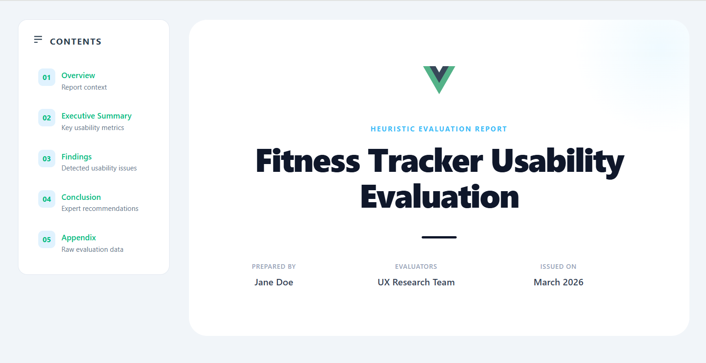
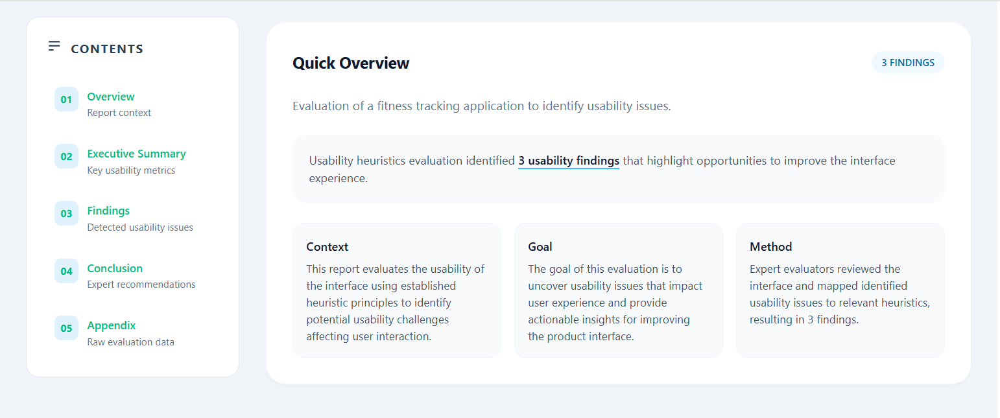
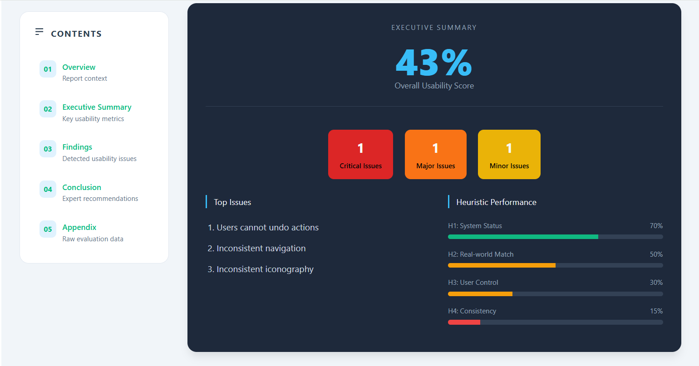
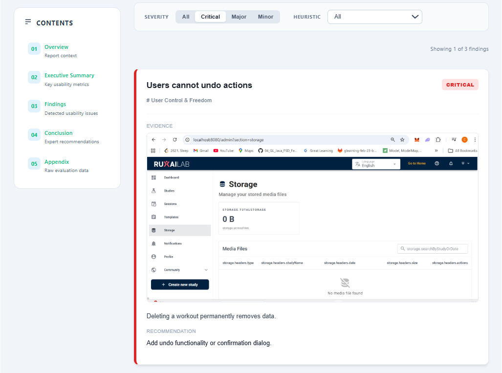
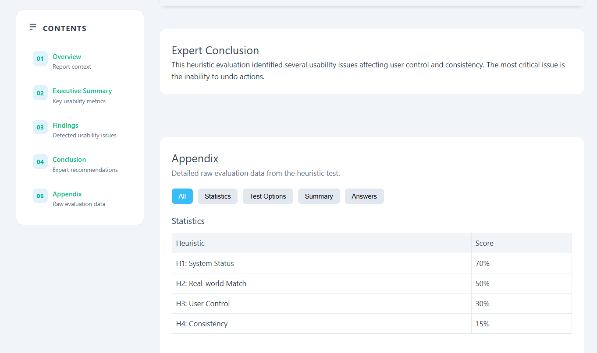

# RUXAILAB Heuristic Evaluation Report Prototype

Prototype demonstrating an improved layout and readability for heuristic evaluation reports generated in **RUXAILAB**.

This project explores how usability evaluation results can be presented in a clearer, more structured, and more actionable format for designers, developers, and researchers.

---

## 📌 Problem

The current heuristic evaluation report generated by RUXAILAB primarily uses table-based layouts. While this provides complete information, it has some usability issues:

- Difficult to quickly scan key findings  
- Limited visual hierarchy  
- Important issues are not emphasized  
- No quick overview of usability performance  
- Hard for stakeholders to prioritize fixes  

Because heuristic evaluations are often used by design and development teams, reports should allow readers to quickly understand:

- Overall usability performance  
- Most critical issues  
- Affected heuristics  
- Recommended improvements  

---

## 💡 Proposed Solution

This prototype redesigns the heuristic evaluation report with a clearer information architecture and improved visual readability.

### 1. Structured Report Sections
- Report Header  
- Quick Overview  
- Executive Summary  
- Findings  
- Conclusion  
- Appendix  

This structure improves readability and makes the report easier to navigate.

### 2. Visual Summary Components
The report includes a **Quick Overview** section containing:
- Overall usability score  
- Key usability insights  
- Summary description of the evaluation  

### 3. Executive Summary
Highlights the most important usability findings:
- Overall usability score  
- Top issues  
- Heuristic performance distribution  

### 4. Card-Based Findings
Instead of large tables, each usability issue is presented as a **structured card**:

**Issue Title**  
- Severity: Major  
- Heuristic: Consistency & Standards  

**Evidence**  
Explanation of the usability problem observed during evaluation.  

**Recommendation**  
Suggested design improvement.  

This format makes findings easier to scan and understand.

### 5. Filtering and Navigation
Findings can be filtered by:
- Severity level  
- Heuristic category  

### 6. Export Consistency
The redesigned report structure remains consistent across:
- Web report view  
- Exported PDF reports  

---

## 🏗 Prototype Architecture

Built using **Vue 3** and **Vite 4**.

Component structure:
```
src/
 ├── components/
 │    ├── AppendixData.vue
 │    ├── ExecutiveSummary.vue
 │    ├── FindingDetailModal.vue
 │    ├── Filters.vue
 │    ├── FindingCard.vue
 │    ├── FindingsList.vue
 │    ├── HeuristicPerformance.vue
 │    ├── QuickOverview.vue
 │    ├── ReportConclusion.vue
 │    └── ReportHeader.vue
 │
 ├── data/
 │    └── mockReportData.js
 │
 └── view/
      └── ReportView.vue

```


Each section is implemented as a reusable component to maintain clear separation of concerns.

---

## 📸 Screenshots

<p align="center">
  <a href="docs/report-header.png">
    
  </a><br/>
  <em>Figure 1: Report Header</em>
</p>

<p align="center">
  <a href="docs/report-overview.png">
    
  </a><br/>
  <em>Figure 2: Report Overview</em>
</p>

<p align="center">
  <a href="docs/executive-summary.png">
    
  </a><br/>
  <em>Figure 3: Executive Summary</em>
</p>

<p align="center">
  <a href="docs/findings.png">
    
  </a><br/>
  <em>Figure 4: Findings Grid</em>
</p>

<p align="center">
  <a href="docs/conclusion+appendix.png">
    
  </a><br/>
  <em>Figure 5: Appendix</em>
</p>

## ⚙️ Technologies Used
### Core Technologies
- **Vue 3** (^3.5.29) – Progressive JavaScript framework for building user interfaces  
- **Vuetify** (^4.0.1) – Material Design component framework for Vue  
- **Vite 4** (^4.5.14) – Modern build tool and dev server  
- **@vitejs/plugin-vue** (^4.6.2) – Vite plugin for Vue single-file component support    

--- 

## system diagram
```
RUXAILAB Backend
(Firebase Cloud Functions)
        │
        │
        │  Evaluation Data
        ▼
RUXAILAB Frontend
(Vue.js Application)
        │
        │
        │  Report Data
        ▼
New Report Layout Components
(Vue Components)

 ├── ReportHeader
 ├── QuickOverview
 ├── ExecutiveSummary
 ├── Filters
 ├── FindingCard
 ├── ReportConclusion
 └── AppendixData
        │
        │
        │ Rendered Report
        ▼
Improved Report View
(Web Interface)
        │
        │
        ▼
PDF Export
(Laravel / PHP Generator)
```

## 🔗 Future Integration with RUXAILAB

Integration would involve:
- Rendering report data from the RUXAILAB backend  
- Adding the new report view inside the RUXAILAB frontend  
- Updating the PDF template to follow the same information architecture  

This ensures consistent report structure across web and exported formats.

---

## 📚 Project Context

This prototype was created while exploring improvements for the **RUXAILAB Heuristic Evaluation Report Layout and Readability Improvements** project.

Focus areas include:
- UX reporting  
- Information architecture  
- Usability evaluation visualization  
- Readable evaluation outputs  

---

## 🚀 Running the Project

Install dependencies:
```bash
npm install
```
Start the development server:
```
npm run dev
```

---
## 🌍 GSoC Context
This prototype was developed as part of my Google Summer of Code (GSoC) project proposal to improve the layout and readability of heuristic evaluation reports in RUXAILAB.
